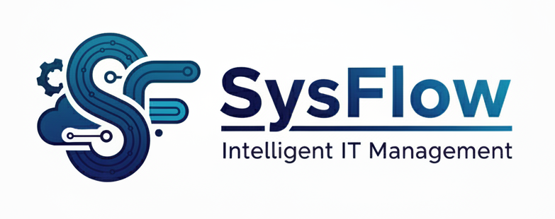
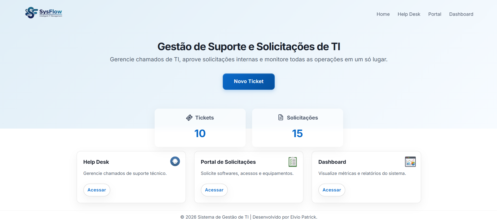
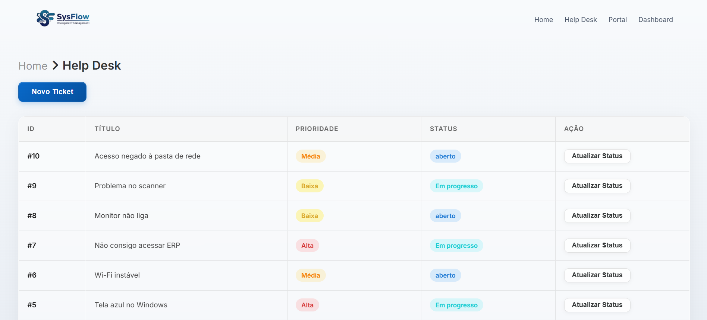
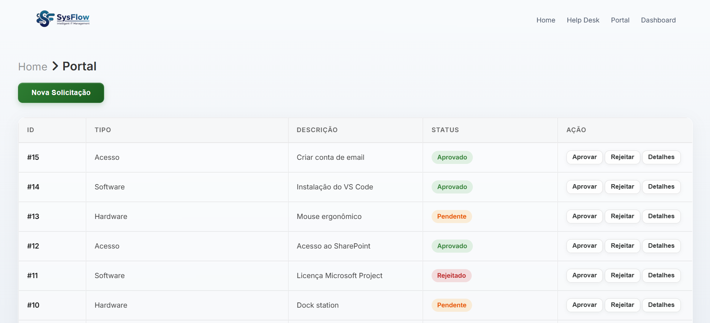
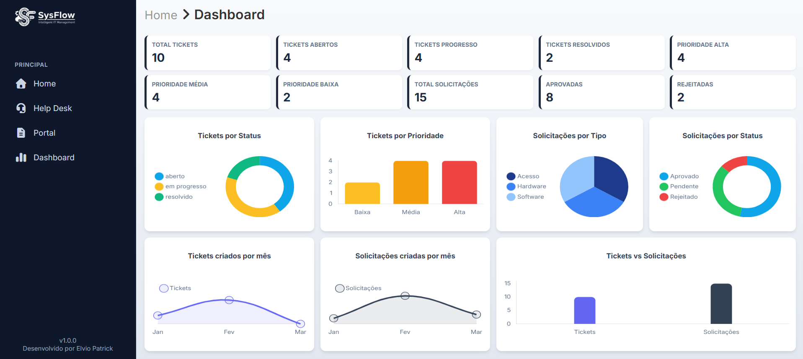

<h1 align="center">💻 SysFlow - Mini ITSM Platform</h1>

<p align="center">
  
</p>

**SysFlow** é uma plataforma **mini ITSM (IT Service Management)** desenvolvida como projeto de portfólio para demonstrar habilidades em **HTML, CSS, JavaScript, PHP e MySQL**, simulando funcionalidades de plataformas profissionais como **ServiceNow** e **Jira Service Management**.

O projeto foca em **gestão de tickets, solicitações de TI e dashboards interativos**, mostrando capacidade de integrar **frontend moderno, backend em PHP e banco de dados MySQL**, com APIs internas.

[🔗 Acesse o SysFlow Online](https://sysflow.wuaze.com/) 

---

## 📌 Funcionalidades

### 1. Help Desk / Tickets
- Criar, visualizar e atualizar tickets de TI.
- Modal moderno e centralizado com animações de fade-in.
- Gestão de prioridade (Baixa, Média, Alta) e status (Aberto, Em Progresso, Resolvido).
- Lista de tickets com cores e badges por prioridade e status.

### 2. Portal de Solicitações de TI
- Criar solicitações de hardware, software ou acessos.
- Modal interativo com formulário intuitivo.
- Aprovação ou reprovação de solicitações.
- Histórico de solicitações por usuário.

### 3. Dashboard Interativo
- **KPI Cards**: Total de tickets, tickets abertos, em progresso, resolvidos, prioridade alta/média/baixa; total de solicitações, aprovadas e reprovadas.
- **Gráficos dinâmicos** usando Chart.js:
  - Tickets por status (doughnut)
  - Tickets por prioridade (bar)
  - Tickets criados por mês (line)
  - Solicitações criadas por mês (line)
  - Solicitações por tipo (pie)
  - Solicitações por status (doughnut)
  - Comparativo Tickets vs Solicitações (bar)
- Layout moderno com cards, cores e responsividade.
- Dados carregados dinamicamente via **fetch**.

---

## 🖼 Screenshots

### Home


### Help Desk / Tickets


### Solicitações de TI


### Dashboard


---

## 🛠 Tecnologias Utilizadas

- **Frontend:** HTML5, CSS3, JavaScript
- **Backend:** PHP 7+  
- **Banco de Dados:** MySQL  
- **Gráficos:** Chart.js  
- **Design:** CSS moderno com cards, modais centralizados e responsivos  

---

## 📂 Estrutura do Projeto

```text
ti-system/
│
├── index.php # Home
├── README.md
│
├── helpdesk/
│      └── index.php # Módulo Tickets
│
├── portal/
│      └── index.php # Módulo Requests
│
├── dashboard/
│      └── index.php # Dashboard interativo
│
├── assets/
│      ├── css/
│      ├── js/
│      └── image
│
├── actions/
│      ├── create_ticket.php
│      ├── update_ticket.php
│      ├── create_request.php
│      ├── approve_request.php
│      └── approve_request.php
│
├── api/
│    ├── get_ticket.php
│    ├── get_request.php
│    └── dashboard_stats.php
│
│
└── config
       └── database.php
    
```

## 🔗 APIs & Actions do SysFlow

O SysFlow possui APIs e actions internas que conectam o frontend, o backend e o banco de dados. Todas são projetadas para fornecer dados em tempo real, suportar KPIs e alimentar dashboards interativos.

| Endpoint / Action | Descrição | Método | Parâmetros | Retorno |
|------------------|-----------|--------|------------|---------|
| `dashboard_stats.php` | Retorna todos os dados do dashboard (KPI Cards e gráficos). | GET | Nenhum | JSON com KPIs, totais e dados para gráficos. |
| `create_ticket.php` | Cria um novo ticket de Help Desk no banco de dados. | POST | `title` (string) – Título do ticket <br> `description` (string) – Descrição do problema <br> `priority` (string) – Baixa, Média ou Alta | Redireciona para Help Desk ou retorna JSON de confirmação. |
| `update_ticket.php` | Atualiza o status de um ticket existente. | POST | `id` (int) – ID do ticket <br> `status` (string) – Aberto, Em progresso ou Resolvido | Redireciona para Help Desk ou retorna JSON de confirmação. |
| `create_request.php` | Cria uma nova solicitação de TI (hardware, software ou acesso). | POST | `title` (string) – Título da solicitação <br> `description` (string) – Detalhes da solicitação <br> `type` (string) – Hardware, Software, Acesso <br> `status` (string) – Pendente | Redireciona para Portal de Solicitações ou retorna JSON de confirmação. |
| `update_request.php` | Atualiza o status de uma solicitação de TI existente. | POST | `id` (int) – ID da solicitação <br> `status` (string) – Pendente, Aprovado ou Reprovado | Redireciona para Portal de Solicitações ou retorna JSON de confirmação. |
| `get_ticket.php` | Retorna dados completos de um ticket específico. | GET | `id` (int) – ID do ticket | JSON com título, descrição, prioridade, status, data de criação. |
| `get_request.php` | Retorna dados completos de uma solicitação específica. | GET | `id` (int) – ID da solicitação | JSON com título, descrição, tipo, status, data de criação. |

## ⚡ Como Rodar Localmente

**Clonar o repositório:**

git clone https://github.com/elviopatrickdev/sysflow_ITSM.git

**Configurar banco MySQL:**

- Criar banco sysflow

- Importar tabelas tickets e requests

- Atualizar config/database.php com suas credenciais.

- Executar em servidor local (XAMPP, WAMP, Laragon):

- Coloque ti-system em htdocs ou equivalente

- Acesse http://localhost/ti-system/index.php

## 🏗 Roadmap de Melhorias

- Autenticação de usuários (Admin, Gerente, Colaborador)

- SLA e timers de tickets

- Histórico de alterações / log de atividades

- Notificações internas / email alerts

- Filtro avançado de tickets e solicitações

- Exportação de relatórios (PDF / Excel)

## 📄 Licença

Open-source para fins de portfólio e aprendizado.

---

Este projeto foi desenvolvido por **Elvio Patrick**.

- [LinkedIn](https://www.linkedin.com/in/elviopatrickdev/) 

- [GitHub](https://github.com/elviopatrickdev)


